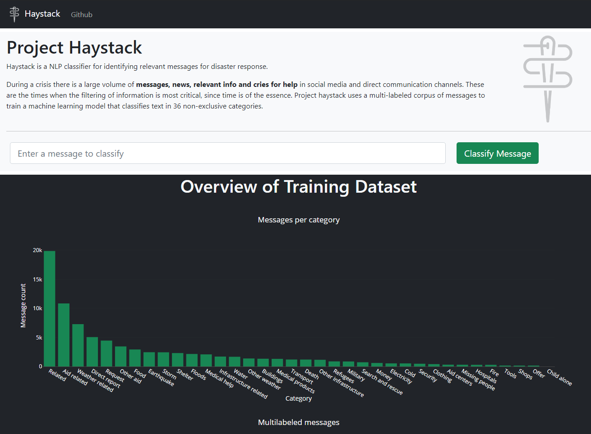
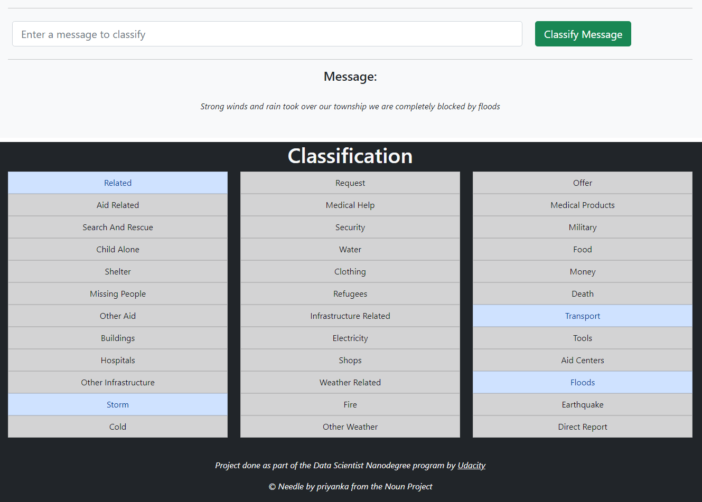

# Project Haystack

An NLP/ML system for classifying disaster response messages. Project encompasses all steps of a simple ML pipeline, including ETL, Modeling/Optimization and deployment on a web app built with flask and bootstrap.

## Quickstart
To run the web app locally, start by creating a virtual environment
```bash
# On Linux
virtualenv .venv -p python3
source .venv/bin/activate

# On Windows Powershell
python -m virtualenv .venv
./.venv/Scripts/Activate.ps1

# or on Windows Git Bash
python -m virtualenv .venv
source ./.venv/Scripts/activate
```

Install dependencies listed in `requirements.txt`
```bash
pip install -r requirements.txt
```

Run the flask backend locally in debug mode
```bash
python haystack/webapp/run.py
```

Open the flask provided address in a browser (example below)
```
* Running on http://192.168.0.12:3001/ (Press CTRL+C to quit)
```
The main page shows a summary of the project and an input field for running the classifier on custom text.


Entering a custom message and clicking "Classify Message" runs the classifier on the backend and returns all relevant classes for the provided message.


## Project structure

- The `haystack` package contains all data and code required to run the ML pipeline and webapp
    - Under `haystack/data` the raw csv files and processed SQLite db are stored, as well as the `process_data.py` ETL Pipeline code.
    - On `haystack/modeling` you'll find the required script for training the classifier (`train_classifier.py`) as well as the pickled model (`classifier.pkl`) and custom sklearn transformers (`custom_features.py`).
    - Finally, under `haystack/webapp` is all the code, html and assets required for running the Flask app (`run.py`).
- The `notebooks` dir contains the preparation ipython notebooks used for the ETL, modeling and data visualization tasks.
- The `tests` module include custom transformer tests to be run with `pytest`

## Running the pipelines
Even though all required files for running the web app are included in the repo (such as the processed database and trained classifier), you can rerun the ETL and training scripts with the provided data or your own custom dataset.

To run the ETL Pipeline run the `process_data.py` script with the messages and categories csv file paths followed by your desired SQLite database path:
```bash
# Example
cd haystack/data
python process_data.py ./disaster_messages.csv ./disaster_categories.csv ./DisasterResponse.db
```

To run the training script, provide the path to the database file and the desired path of the output `.pkl` model file, respectively:
```bash
# Example
cd haystack/modeling
python train_classifier.py ../data/DisasterResponse.db ./classifier.pkl
```
----
*PS. the webapp expects the exact same file paths for the database and pickled classifier as shown in the previous examples, if you'd like to point to different source files, you should alter the `run.py` script under `haystack/webapp` to accomodate these changes.*


------
*This project is part of the Data Scientist Nanodegree by Udacity*


